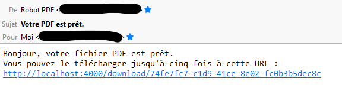

# ToPdf

## Fonctionnalités

Pour le moment, toPdf supporte ces fonctionnalités :

- [x] Authentification par token  
- [x] Générer un PDF avec wkhtmltopdf comme moteur  
- [ ] Générer un PDF avec chrome comme moteur  
- [x] Générer un PDF à partir de HTML pré-rendu  
- [ ] Générer un PDF à partir d'une URL  
- [x] Envoyer un e-mail avec un lien de téléchargement du PDF (valable 5 fois)  
- [x] Renvoyer automatiquement les e-mails en cas d'échec (incremental retry, 5 fois, espacé de n * 5 secondes.)  
- [ ] Internationalisation des messages aux utilisateurs
- [ ] Avertir d'une conversion PDF échouée  
- [ ] Avertir d'une défaillance longue durée de l'API d'envoi d'e-mails  
- [x] Directement streamer le PDF en réponse à la requête  
- [ ] Panneau de contrôle pour voir les jobs  
- [ ] Panneau de contrôle pour voir les utilisateurs  



## Installation
Installer les dépendances avec `mix deps.get`.
Fournir les variables d'environnement nécessaires (voir le fichier `.env.template`) :

```bash
export SECRET_KEY_BASE=
export MAILJET_API_KEY=
export MAILJET_API_SECRET=
export MAIL_FROM_NAME=
export MAIL_FROM_ADDRESS=
export APP_DEVELOPER_EMAIL=
export TOPDF_PUBLIC_URL=
```

## Authentification 

Pour le moment, une liste de tokens est à fournir en fichier de configuration dans `~/.config/to_pdf/tokens`, un token par ligne.

## Usage

Envoyer un `POST` sur `/print`, avec ces paramètres :

```elixir
%{
  token: <string>
  email: <string> | nil
  type: "url" (non implémenté) | "html_body" (ok)
  data: <string : url to visit> | <string : long rendered html body>
  printer: "webkit" (ok) | "chrome" (non implémenté)
  printer_params: <shell printer parameters: no user-controlled input.>
}
```

Si `email` est `nil`, vous recevrez le PDF en corps de la réponse.

## Implémentation

Pour le moment, le gros du travail est fait dans ces modules :

- Piper (piper.ex) : utilitaire pour réprésenter des pipelines d'étapes de travail pouvant échouer
- DownloadAgent (download_agent.ex) : Gère les liens de téléchargement et leur expiration
- DownloadServer (download_server.ex) : Gère l'intervalle de collecte des liens expirés
- AuthAgent (auth_agent.ex) : S'occupe de charger et vérifier les tokens valides
- Printer (printer.ex) : Contient la délégation des tâches à Chrome / Wkhtmltopdf
- Notifier (notifier.ex) : Envoie les notifications de succès ou d'échec des tâches
